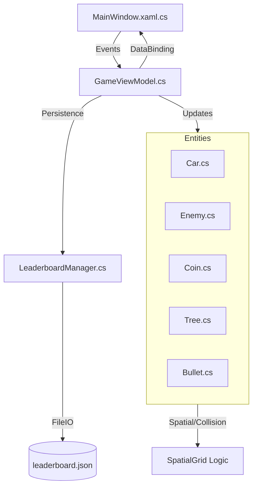
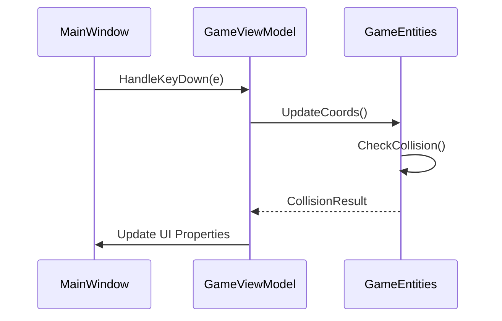

# Deep Engineering Architecture

## Global Data Flow
The application follows a standard MVVM-inspired pattern where the game logic is centralized in the view model, which orchestrates game entities and UI updates.

*Traceability Legend:*
- `UI`: [[WpfApp1/MainWindow.xaml.cs]]
- `VM`: [[WpfApp1/Models/GameViewModel.cs]]
- `Entities`: [[WpfApp1/Models/Car.cs]], [[WpfApp1/Models/Enemy.cs]], [[WpfApp1/Models/Coin.cs]], [[WpfApp1/Models/Tree.cs]], [[WpfApp1/Models/Bullet.cs]]
- `LM`: [[WpfApp1/Models/LeaderboardManager.cs]]

## Core Interface Flows
The following sequence illustrates the game loop processing for user interactions and object updates.

*Traceability Legend:*
- `UI`: [[WpfApp1/MainWindow.xaml.cs]]
- `VM`: [[WpfApp1/Models/GameViewModel.cs]]
- `E`: [[WpfApp1/Models/GameObject.cs]]

## Architectural Decision Records (ADRs)

### 🚀 ADR 001: Use of MVVM Pattern for Game State
- **Context**: The game requires complex state management involving UI elements, physics/collision, and user input.
- **Decision**: Implemented `GameViewModel` acting as the central hub for game state, utilizing `INotifyPropertyChanged` for UI reactivity.
- **Rationale**: Decouples business logic from the `MainWindow` code-behind, facilitating better testability and cleaner UI updates.
- **Consequences**: Centralizes logic, but created a monolithic `GameViewModel` that risks becoming a maintenance hotspot.

### 🛠️ ADR 002: Spatial Grid for Object Management
- **Context**: Collision detection across numerous game entities (Coins, Obstacles, Trees) was causing performance degradation.
- **Decision**: Implemented a `Dictionary<int, HashSet<FrameworkElement>>` based spatial grid for optimized proximity checks.
- **Rationale**: Reduces the complexity of collision checks from O(N^2) to near O(1) for local spatial lookups.
- **Consequences**: Increased memory footprint and added complexity to entity reset/repositioning logic.

## Module Deep-Dives

### Module: [[WpfApp1/Models/GameViewModel.cs]]
- **Responsibility**: Orchestrates the entire game loop, manages collections of game entities, and binds to the UI.
- **Internal Logic**: Uses `DispatcherTimer` to drive game ticks, manages entity lifecycles, and processes input events forwarded from [[WpfApp1/MainWindow.xaml.cs]].
- **Upstream Callers**: [[WpfApp1/MainWindow.xaml.cs]]
- **Downstream Dependencies**: [[WpfApp1/Models/Car.cs]], [[WpfApp1/Models/Enemy.cs]], [[WpfApp1/Models/Coin.cs]], [[WpfApp1/Models/Tree.cs]], [[WpfApp1/Models/Bullet.cs]], [[WpfApp1/Models/Obstacle.cs]]

### Module: [[WpfApp1/Models/Car.cs]]
- **Responsibility**: Manages the player's controlled entity movement and boundaries.
- **Internal Logic**: Translates keyboard input into `Canvas` coordinate updates; enforces road boundaries.
- **Upstream Callers**: [[WpfApp1/Models/GameViewModel.cs]]
- **Downstream Dependencies**: None.

### Module: [[WpfApp1/Models/LeaderboardManager.cs]]
- **Responsibility**: Handles serialization and persistence of high scores.
- **Internal Logic**: Uses `Newtonsoft.Json` to read/write from a local `leaderboard.json` file; implements `INotifyPropertyChanged` to refresh UI lists.
- **Upstream Callers**: [[WpfApp1/MainWindow.xaml.cs]]
- **Downstream Dependencies**: [[WpfApp1/Models/Leaderboard.cs]]

## Structural & Integration Risks

> [!CAUTION]
> **Orphan Modules**: Multiple model classes (e.g., [[WpfApp1/Models/Bullet.cs]], [[WpfApp1/Models/Coin.cs]]) were identified as orphan modules. They lack clear inbound dependency references in the graph, indicating potential dead code or reliance on loose, implicit instantiation within [[WpfApp1/Models/GameViewModel.cs]].

> [!WARNING]
> **Hotspot Risk**: [[WpfApp1/Models/GameViewModel.cs]] and [[WpfApp1/Models/Car.cs]] are identified as high-risk hotspots. Their combined complexity and central role in the game logic make them highly susceptible to regressions during refactoring.

> [!NOTE]
> **Contract Risks**: The lack of explicit interfaces for game entities forces [[WpfApp1/Models/GameViewModel.cs]] to tightly couple with concrete implementations, reducing extensibility for future entity types.